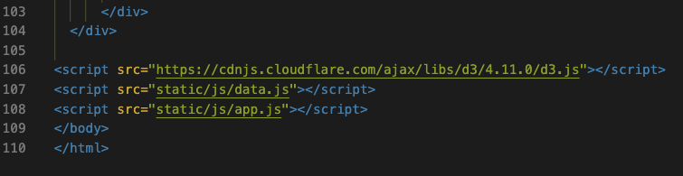

# UFOs

## Overview of Project

The purpose of this analysis was to gain hands-on experience with JavaScript basics, and its components and objects to build webpages. JavaScript is a front end development language that adds extra functionality and customization to enhance user experience. To gain a greater understanding of JavaScript, we looked into its technical aspects and application to the field of data analytics and visualization.

The goal was to create an interactive webpage that responds to user inputs and visually adjust to reflect that interaction. A dataset file stored in a JavaScript array containing a sample set of UFO sightings, its locations, and types was provided to complete the task.

## Resources

- Basic HTML
- Bootstrap
- CSS
- JavaScript
- data.js (JavaScript UFO file)

## Results

The interactive webpage allows the user to search multiple categories. The user can set multiple filters to search for for UFO sightings based on the following criteria:

- Date
- City
- State
- Country
- Shape

### Fig.1
The final product shows a dark page with white font. It is a clean and visually appealing page where each element is well uniformed with  the text.

### Fig.2
This image illustrates how code d3.selectAll().on() was added to select the changed element and retrieve the changed property. D3.js can "listen" for events that occur on webpages, such as button clicks, mouse events, keyboard, text composition, forms, etc.

### Fig.3
This image illustrates a functional table with the ability to filter specific information using the Dev tool. When activated, it reacts to user input. When the user enters the search criteria, the JavaScript code stores the values in the textbox in a JS object. Multiple filters can be entered simultaneously to enable users refine their search.

### Fig.4
This image shows the code from the index.html file. This code creates the search parameters organized as list elements. Each list has HTML components: a label and an input. The label is used as a prompt to encourage users to input a date, city, state, country, or shape. The type="text" indicates that the code will look for text to be input. The placeholder is an example of what to search for (e.g., US, Fresno). The id=" " is what JavaScript code will look for when the user enters the desired input when the function is executed.

### Fig.5
This image illustrates the order (order matters in this line of code) of the multiple script links to the webpage. The files will be executed based on the order they are linked. If a specific order was not followed, the app may try to build the table before loading the data and generate an error.

## Summary

The webpage created included a dynamic table based on UFO sightings. It will enable users to search and filter the data for specific values. The webpage demonstrates the power of inserting JavaScript into an HTML file along with utilizing CSS and D3.js. 

One drawback on this webpage is not having a search bar that allows the user to see more references in order to validate the sightings. The information in the data.js was limited to comments from a selected few individuals versus having a greater sample to validate each claim. 

To further improve this webpage, I would recommend having additional data stating how many individuals were present at each event. Further, additional data should be added when new cases are reported. Another recommendation would be adding an additional filter that reflects on updated information from the dataset.

### Deployment Link

- https://jacqueline-esbri.github.io/UFOs/
